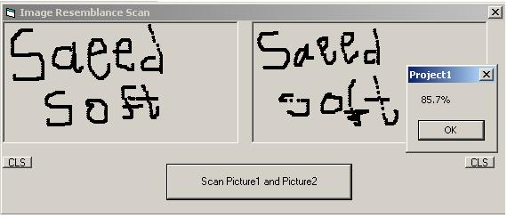



## Image Resemblance Scan

### Description

pictures are compared in this program of parity pixels point of view that are located in end part and shown parity percent.
 
### More Info
 

             |
---                |---
**Submitted On**   |2006-12-22 02:31:46
**By**             |[saeed sheikholeslami](https://github.com/Planet-Source-Code/PSCIndex/blob/master/ByAuthor/saeed-sheikholeslami.md)
**Level**          |Intermediate
**User Rating**    |3.7 (11 globes from 3 users)
**Compatibility**  |VB 6\.0
**Category**       |[Graphics](https://github.com/Planet-Source-Code/PSCIndex/blob/master/ByCategory/graphics__1-46.md)
**World**          |[Visual Basic](https://github.com/Planet-Source-Code/PSCIndex/blob/master/ByWorld/visual-basic.md)
**Archive File**   |[Image\_Rese20388112222006\.zip](https://github.com/Planet-Source-Code/saeed-sheikholeslami-image-resemblance-scan__1-67435/archive/master.zip)

